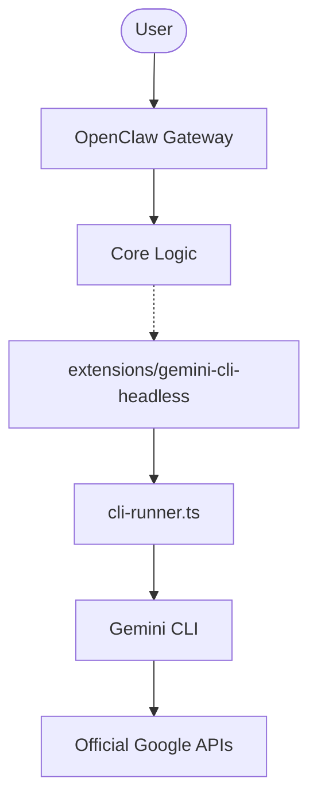
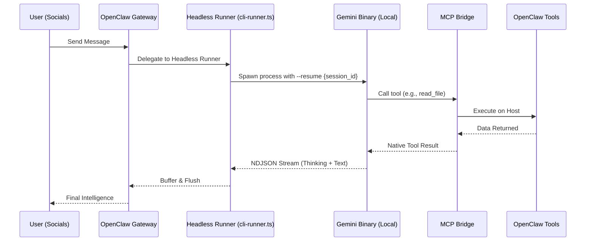

# 🦞 OpenClaw (h0tp-ftw's fork)

<p align="center">
    <picture>
        <source media="(prefers-color-scheme: light)" srcset="https://raw.githubusercontent.com/openclaw/openclaw/main/docs/assets/openclaw-logo-text-dark.png">
        
    </picture>
</p>

<p align="center">
  <strong>The OpenClaw we love, but powered by Gemini CLI.</strong>
</p>

<p align="center">
  <a href="https://github.com/openclaw/openclaw/actions/workflows/ci.yml?branch=main"></a>
  <a href="https://github.com/openclaw/openclaw/releases"></a>
  <a href="https://discord.gg/clawd"></a>
  <a href="LICENSE"></a>
</p>

---

## The Vision
**OpenClaw (h0tp-ftw's fork)** is a high-performance fork of OpenClaw that uses the **official Gemini CLI** as a headless backend. This provides:
- ✅ **100% ToS Compliance**: Authorized OAuth flows via official binaries.
- ✅ **Massive Context**: Leverage the full context windows of Gemini Pro/Flash (up to 1M tokens) with generous daily limit resets.
- ✅ **Zero-Setup**: Pre-configured for headless usage with your Google account.

DISCLAIMER: The author does not guarantee that you will not get banned from using the Gemini CLI. Use at your own risk.

---

## 🚀 Quick Install (Linux / macOS)

**Automatic Install** (Recommended for users):
```bash
curl -fsSL https://raw.githubusercontent.com/h0tp-ftw/openclaw/main/install.sh | bash
```
> [!NOTE]
> **Windows Users**: Install [WSL2](https://learn.microsoft.com/en-us/windows/wsl/install) and run the command above inside your Linux distribution.

### One-Step Install (Recommended)

1.  **Clone this fork**:
    ```bash
    git clone https://github.com/h0tp-ftw/openclaw.git
    cd openclaw
    ```

2.  **Run the Installer**:
    ```bash
    ./install.sh
    ```

    This will install dependencies and build the project.

### Updating

To update your installation (pulling latest features from official OpenClaw + keeping Gemini support):

```bash
(Or manually: `git pull --rebase && pnpm i && pnpm build`)

## Manual Install / Developer Setup

If you are deploying this fork or developing locally:

1.  **Clone & Install**:
    ```bash
    git clone https://github.com/h0tp-ftw/openclaw.git
    cd openclaw
    pnpm install
    # Important: This installs dependencies including the new extension
    ```

2.  **Build**:
    ```bash
    pnpm build
    # Compiles core and extensions
    ```

3.  **Run**:
    ```bash
    pnpm start
    # The 'gemini-cli-headless' extension will load automatically.
    ```
    
---

## 🔌 Extensions & Plugins

Since I restored `src/` to a clean state, all custom logic lives in `extensions/`.

- **Enabling Bundled Extensions**:
  The `gemini-cli-headless` extension is bundled and **enabled by default** in this fork. You don't need to do anything!
  (If you ever disable it, re-enable with: `openclaw plugins enable gemini-cli-headless`)

- **Installing 3rd Party Extensions**:
  You can easily install external extensions from npm or local paths:
  ```bash
  openclaw plugins install <npm-package-name>
  openclaw plugins install ./path/to/extension.tgz
  ```


## 🏗️ Architecture: How It Works

This fork functions as a supercharged **Extension** to OpenClaw. The core logic remains 100% compatible with upstream, while the `gemini-cli-headless` backend is dynamically loaded from `extensions/`.


### How it works
1.  **Extension Loading**: OpenClaw detects the `gemini-cli-headless` extension at startup.
2.  **Orchestration**: The core CLI runner spawns the `gemini` binary in headless JSON-streaming mode.
2.  **Tool Bridge**: OpenClaw's system tools (file I/O, shell, etc.) are exposed to the CLI via an automatically injected MCP extension.
3.  **Session Sync**: Conversations are persisted via the CLI's native `--resume` protocol.
4. **Google Tools**: Since this is Gemini CLI, it has access to tools like web search and codebase agent for **FREE**!

### Sequence Flow


---

## 📖 Key Documentation
- [**Gemini CLI Backend Guide**](docs/cli/gemini-cli-backend.md) — Technical deep dive into the integration.
- [**Legal Compliance & ToS**](docs/legal-compliance.md) — Why this is the safest way to automate Gemini.
- [**Headless Architecture**](docs/cli/gemini-cli-headless-architecture.md) — Under the hood of how this works.

---
## 🤝 Contributing
This fork is a community effort! Whether you want to add support for Anthropic (Claude Code), OpenAI (Codex), or other CLI backends, or improve existing integrations, your PRs are welcome :)

- **Found a bug?** Open an [Issue](https://github.com/h0tp-ftw/openclaw/issues).

---
## ✨ Bottom Line

I love OpenClaw, and I made this fork to ensure that I could use the generous allowed usage for Gemini CLI while not getting banned for ToS violations. I have not been able to reach OpenClaw devs on integrating this directly into the main project, so I am releasing this fork independently.
