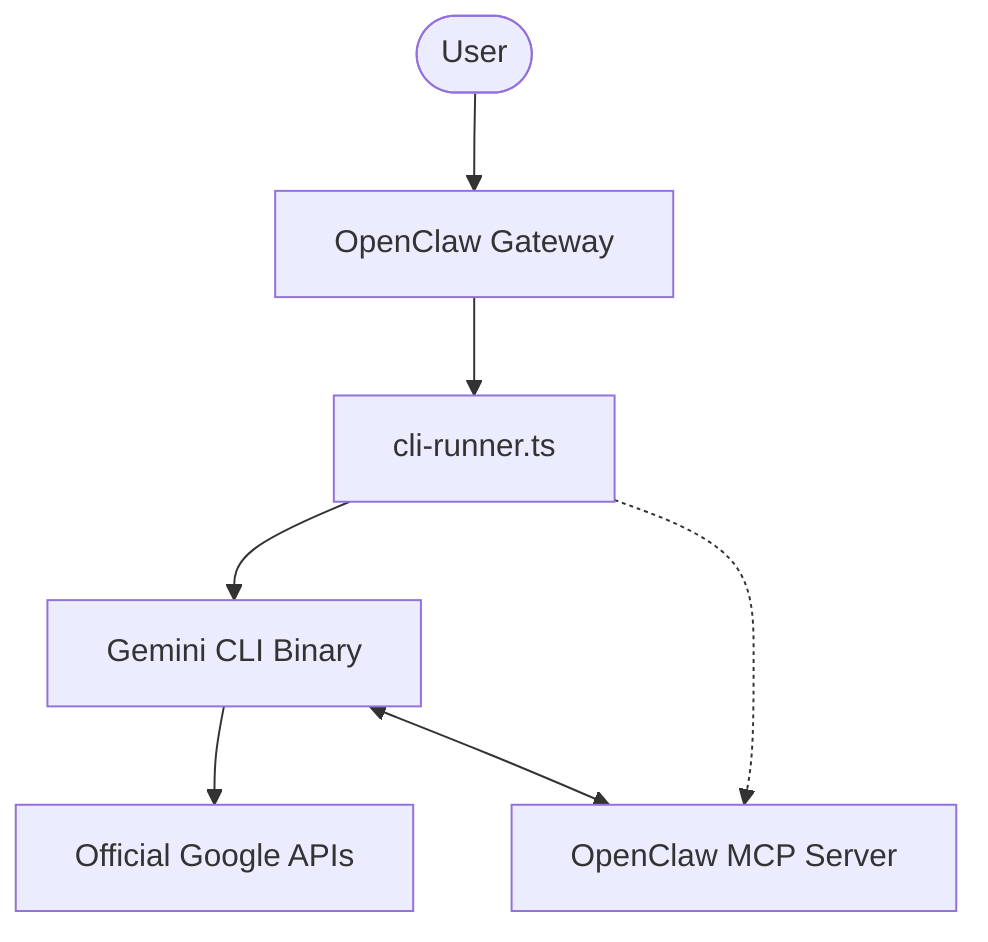

# 🦞 OpenClaw (h0tp-ftw's fork)

<p align="center">
    <picture>
        <source media="(prefers-color-scheme: light)" srcset="https://raw.githubusercontent.com/openclaw/openclaw/main/docs/assets/openclaw-logo-text-dark.png">
        
    </picture>
</p>

<p align="center">
  <strong>The OpenClaw we love, but powered by Gemini CLI.</strong>
</p>

<p align="center">
  <a href="https://github.com/openclaw/openclaw/actions/workflows/ci.yml?branch=main"></a>
  <a href="https://github.com/openclaw/openclaw/releases"></a>
  <a href="https://discord.gg/clawd"></a>
  <a href="LICENSE"></a>
</p>

---

## The Vision
**OpenClaw (h0tp-ftw's fork)** is a high-performance fork of OpenClaw that uses the **official Gemini CLI** as a headless backend. This provides:
- ✅ **100% ToS Compliance**: Authorized OAuth flows via official binaries.
- ✅ **Massive Context**: Leverage the full context windows of Gemini Pro/Flash (up to 1M tokens) with generous daily limit resets.
- ✅ **Zero-Setup Tools**: OpenClaw's elite coding tools bridged directly to the CLI via MCP.

DISCLAIMER: The author does not guarantee that you will not get banned from using the Gemini CLI. Use at your own risk.

---

## 🚀 One-Step Install (Linux / macOS)

```bash
curl -fsSL https://raw.githubusercontent.com/h0tp-ftw/openclaw/main/install.sh | bash
```

> [!NOTE]
> **Windows Users**: Install [WSL2](https://learn.microsoft.com/en-us/windows/wsl/install) first, then run the command above inside your Linux distribution.

---

## 🏗️ Architecture: How It Works

This fork functions as a supercharged "Headless" wrapper. It doesn't just call an API; it orchestrates an entire CLI session.



1.  **Orchestration**: OpenClaw spawns the `gemini` binary in a headless JSON-streaming mode.
2.  **Tool Bridge**: OpenClaw's system tools (file I/O, shell, etc.) are exposed to the CLI via an automatically injected MCP extension.
3.  **Session Sync**: Conversations are persisted via the CLI's native `--resume` protocol.
4. **Google Tools**: Since this is Gemini CLI, it has access to tools like web search and codebase agent for **FREE**!

---

## 📖 Key Documentation
- [**Gemini CLI Backend Guide**](docs/cli/gemini-cli-backend.md) — Technical deep dive into the integration.
- [**Legal Compliance & ToS**](docs/legal-compliance.md) — Why this is the safest way to automate Gemini.
- [**Headless Architecture**](docs/cli/gemini-cli-headless-architecture.md) — Under the hood of how this works.

---
## ✨ Bottom Line

I love OpenClaw, and I made this fork to ensure that I could use the generous allowed usage for Gemini CLI while not getting banned for ToS violations. I have not been able to reach OpenClaw devs on integrating this directly into the main project, so I am releasing this fork independently
