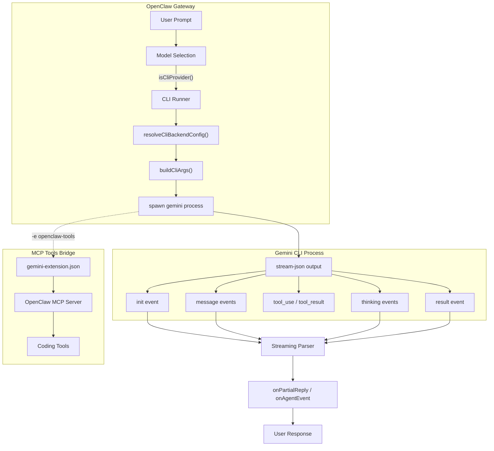

# Gemini CLI Headless Architecture

OpenClaw's **Gemini CLI Headless** backend (`gemini-cli-headless`) spawns the `gemini` binary as a child process for each agent turn, enabling headless AI interactions without direct API calls.

> [!NOTE]
> This is distinct from `google-gemini-cli`, which is the upstream OAuth provider for Google Gemini. The `gemini-cli-headless` backend uses the local CLI binary directly.

## Overview



## Component Map

| Component | File | Purpose |
|-----------|------|---------|
| Provider Detection | [`model-selection.ts`](file:///c:/Users/h0tp/Documents/Code/openclaw/src/agents/model-selection.ts) | `isCliProvider()` routes `gemini-cli-headless` to CLI runner |
| Backend Config | [`cli-backends.ts`](file:///c:/Users/h0tp/Documents/Code/openclaw/src/agents/cli-backends.ts) | `DEFAULT_GEMINI_BACKEND` config, model aliases, merge logic |
| CLI Runner | [`cli-runner.ts`](file:///c:/Users/h0tp/Documents/Code/openclaw/src/agents/cli-runner.ts) | `runCliAgent()` — spawns process, parses streaming output |
| Process Execution | [`exec.ts`](file:///c:/Users/h0tp/Documents/Code/openclaw/src/process/exec.ts) | `runCommandWithTimeout()` with activity-based timeout |
| OAuth Provider | [`auth-choice.apply.google-gemini-cli.ts`](file:///c:/Users/h0tp/Documents/Code/openclaw/src/commands/auth-choice.apply.google-gemini-cli.ts) | Upstream `google-gemini-cli` OAuth wiring (separate from this backend) |

## Data Flow

### 1. Provider Routing

```
isCliProvider("gemini-cli-headless") → true
resolveCliBackendConfig("gemini-cli-headless") → DEFAULT_GEMINI_BACKEND merged with overrides
```

### 2. Backend Configuration

```typescript
const DEFAULT_GEMINI_BACKEND: CliBackendConfig = {
  command: "gemini",
  args: ["--output-format", "stream-json", "--yolo"],
  streamingArgs: ["--output-format", "stream-json", "--yolo"],
  resumeArgs: ["--output-format", "stream-json", "--yolo", "--resume", "{sessionId}"],
  output: "jsonl",
  input: "arg",
  promptArg: "-p",
  modelArg: "-m",
  modelAliases: GEMINI_MODEL_ALIASES,
  sessionMode: "existing",
  sessionIdFields: ["session_id"],
  systemPromptEnvVar: "GEMINI_SYSTEM_MD",
  serialize: true,
};
```

### 3. Final Command

```bash
gemini -e openclaw-tools --output-format stream-json --yolo -m gemini-3-pro-preview -p "prompt"
```

| Flag | Purpose |
|------|---------|
| `-e openclaw-tools` | Load MCP extension for OpenClaw coding tools |
| `--output-format stream-json` | NDJSON streaming output |
| `--yolo` | Auto-approve all tool calls (headless mode) |
| `-m <model>` | Model selection |
| `-p "<prompt>"` | Non-interactive prompt mode |

### 4. System Prompt Injection

Injected via `GEMINI_SYSTEM_MD` env var pointing to a temp file with workspace context, agent config, and heartbeat prompts.

### 5. Streaming JSON Events

| Event Type | Action |
|------------|--------|
| `init` | Captures `session_id` for conversation continuation |
| `message` / `text` | Streams assistant text via `onPartialReply` |
| `thinking` | Streams reasoning tokens via `onReasoningStream` |
| `tool_use` | Emits tool invocation event |
| `tool_result` | Emits tool completion event |
| `result` | Captures usage stats |

### 6. Activity-Based Timeout

Kill timer resets on output activity, preventing premature termination of long-running streaming sessions.

## MCP Tools Bridge

OpenClaw exposes coding tools via auto-generated `gemini-extension.json` manifest, excluding tools the Gemini CLI already provides natively (file I/O, shell, web search).

## Session Management

- **New session**: No `--resume` flag; `init` event returns `session_id`
- **Resumed session**: `--resume {sessionId}` replays conversation context
- **Cleanup**: `cleanupSuspendedCliProcesses()` cleans zombie CLI processes

## Model Aliases

| Alias | Resolves To |
|-------|-------------|
| `pro-3` | `gemini-3-pro-preview` |
| `flash-3` | `gemini-3-flash-preview` |
| `pro` | `gemini-2.5-pro` |
| `flash` | `gemini-2.5-flash` |

## Error Handling

| Exit Code | Meaning | Failover Reason |
|-----------|---------|-----------------|
| 41 | `FatalAuthenticationError` | `auth` |
| 53 | `FatalTurnLimitedError` | `rate_limit` (retryable) |

## Authentication

Headless OAuth flow:
1. `~/.gemini/settings.json` sets `security.auth.selectedType` to `"oauth-personal"`
2. `gemini -p "Hi"` triggers browser OAuth popup
3. Tokens stored locally; subsequent runs use them automatically

## Custom Overrides

```json
{
  "agents": {
    "defaults": {
      "cliBackends": {
        "gemini-cli-headless": {
          "command": "/custom/path/to/gemini"
        }
      }
    }
  }
}
```
